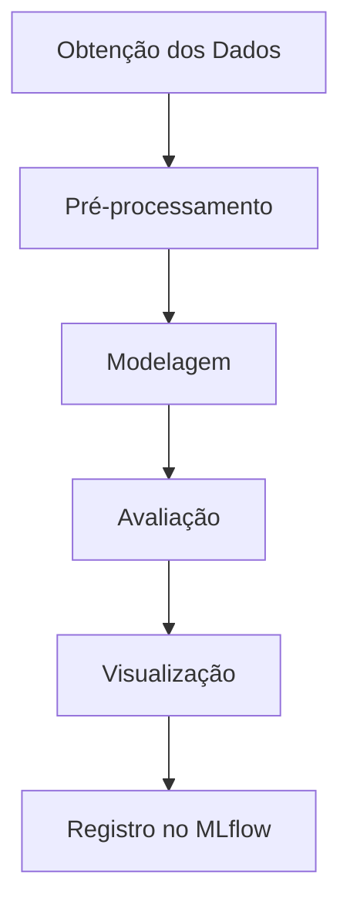

# Projeto de Segmentação de Clientes

## Descrição
Este projeto utiliza técnicas de aprendizado de máquina para realizar a segmentação de clientes com base em seus dados de compras. O objetivo é identificar grupos de clientes com características semelhantes, permitindo estratégias de marketing mais direcionadas e personalizadas.

## Estrutura do Projeto

```
Project - CustomerSeg/
├── main.py                # Arquivo principal para execução da pipeline
├── README.md              # Documentação do projeto
├── requirements.txt       # Dependências do projeto
├── data/                  # Dados utilizados no projeto
│   └── wholesale_datasets.csv
├── docs/                  # Documentação adicional
├── logs/                  # Logs gerados durante a execução
├── notebooks/             # Notebooks para análise exploratória
├── reports/               # Relatórios gerados
├── src/                   # Código fonte
│   ├── pipeline.py        # Pipeline principal
│   ├── config/            # Configurações do projeto
│   ├── model/             # Modelos de aprendizado de máquina
│   ├── postprocessing/    # Pós-processamento dos resultados
│   ├── preprocessing/     # Pré-processamento dos dados
│   └── utils/             # Funções utilitárias
└── tests/                 # Testes do projeto
```

## Diagrama da Pipeline



## Funcionalidades
- **Pré-processamento:** Limpeza e transformação dos dados.
- **Modelagem:** Criação e treinamento de modelos de clustering (KMeans).
- **Avaliação:** Cálculo de métricas como Silhouette Score.
- **Visualização:** Gráficos para análise dos clusters.
- **Automação:** Pipeline completa integrada com MLflow para rastreamento de experimentos.

## Funções de Pré-processamento
As funções de pré-processamento implementadas incluem:
- **Escalonamento:** Utiliza técnicas como `StandardScaler`, `MinMaxScaler` e `RobustScaler` para normalizar os dados.
- **Transformação Logarítmica:** Aplica `log1p` para reduzir a assimetria dos dados.
- **Detecção de Outliers:** Identifica valores extremos com base no intervalo interquartil (IQR).
- **Seleção de Colunas:** Remove colunas constantes ou quase constantes.

Essas técnicas garantem que os dados estejam em um formato adequado para o modelo de clustering, melhorando a qualidade dos resultados.

## Teoria de Aprendizado de Máquina Aplicada
- **Clustering com KMeans:**
  - O KMeans é um algoritmo de aprendizado não supervisionado que agrupa os dados em `k` clusters.
  - Ele minimiza a soma das distâncias quadráticas entre os pontos e os centróides dos clusters.
  - A escolha do número ideal de clusters é feita com base no `Silhouette Score`, que mede a separação e coesão dos clusters.

- **Redução de Dimensionalidade com PCA:**
  - O PCA (Principal Component Analysis) é utilizado para projetar os dados em duas dimensões principais, facilitando a visualização dos clusters.

## Uso do MLflow
O MLflow é utilizado neste projeto para:
- **Rastreamento de Experimentos:** Log de parâmetros, métricas e artefatos.
- **Registro de Modelos:** Armazenamento e versionamento dos modelos treinados.
- **Visualização de Resultados:** Gráficos e métricas podem ser acessados diretamente na interface do MLflow.

Para iniciar o servidor MLflow e visualizar os resultados:
```bash
mlflow ui
```
Acesse a interface em `http://127.0.0.1:5000`.

## Requisitos
- Python 3.9+
- Bibliotecas listadas em `requirements.txt`

## Como Executar
1. Clone o repositório:
   ```bash
   git clone <url-do-repositorio>
   ```
2. Instale as dependências:
   ```bash
   pip install -r requirements.txt
   ```
3. Execute o arquivo principal:
   ```bash
   python main.py
   ```

## Estrutura do Código
### Arquivo `main.py`
Responsável por iniciar a execução da pipeline.

### Arquivo `pipeline.py`
Contém a lógica da pipeline, incluindo:
- Obtenção dos dados
- Pré-processamento
- Modelagem
- Avaliação
- Visualização

### Diretório `src`
Organiza o código em módulos:
- **config:** Configurações gerais do projeto.
- **model:** Modelos de aprendizado de máquina.
- **postprocessing:** Análise dos resultados.
- **preprocessing:** Transformações nos dados.
- **utils:** Funções auxiliares.

## Contato
Para dúvidas ou sugestões, entre em contato pelo email: [emersonssmile@gmail.com](mailto:emersonssmile@gmail.com).