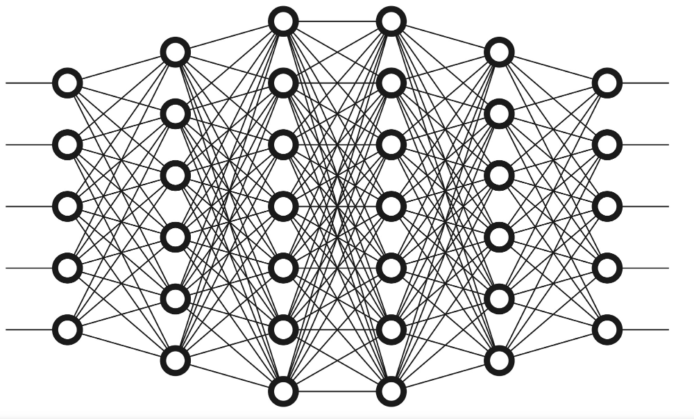
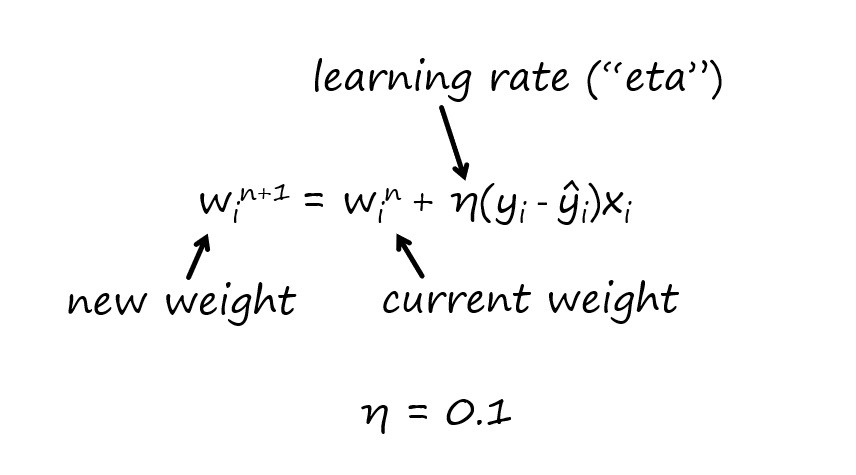

<h1 align="center">
    
</h1>

<h4 align="center"> 
	🚧 DEEP LEARNNG CODES 🚀
</h4>

  

  

  	
  
	
  
  

  
   

## 💻 About the codes

- ['1 - perceptron - Funcao Soma e Funcao Ativacao.py'](https://github.com/emersonrafaels/machine_learning/blob/master/DEEP%20LEARNING/1%20-%20perceptron%20-%20Funcao%20Soma%20e%20Funcao%20Ativacao.py)
    - Coding a perceptron - Sum and Activation functions
- ['2 - perceptron - Auto Ajuste de Pesos.py'](https://github.com/emersonrafaels/machine_learning/blob/master/DEEP%20LEARNING/2%20-%20perceptron%20-%20Auto%20Ajuste%20de%20Pesos.py)
    - Coding a perceptron - Sum and Activation functions 
    - Autocalculate new weight to achieve expected error
    
<h1 align="center">
    
</h1>

<h1 align="center">
    
</h1>
