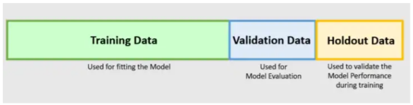

<h1> Holdout </h1>

<h1 align="center">
    
</h1>

<h1> KFolds </h1>

<h1 align="center">
    
</h1>

<h4 align="center"> 
	Machine Learning - Tests and Validation 🚀
</h4>

  	
  
	
  
  

  
   

## 💻 Test and Validation

The **error rate on new cases** (not seen in the training step) is called **error of generalization**. 
This step is util to hyperparameters adjust or model selection. 
There are **two alternatives to model validation**: *cross validation holdout* and *kfolds*.

### Holdout

<h1 align="center">
    
</h1>

1. Train + Validation dataset: Used to choice the best model and hyperparameters
2. Test dataset: Used to evaluate the generalization error.

### Kfolds

## ✍️  Libs

 - **[Scikit Learn](https://scikit-learn.org/)**

## 🛠  Tech

The following libs were used in building the project:

- [Python]

## 🚀 How execute this project

1. **Installing**: pip install -r requirements.txt

## ➊ Requirement

- Before starting, you will need had installed in your machine this tools: (The download can be done in itself page of Python or Anacondaa):
[Python](https://www.anaconda.com/products/individual).

- Do the install of requirements, getting all the necessary libraries for the execution of the project.

## 📝 License

This project are under the MIT License.

Made with ❤️ by **Emerson Rafael** 👋🏽 [Contact me!](https://www.linkedin.com/in/emerson-rafael/)

[Python]: https://www.python.org/downloads/